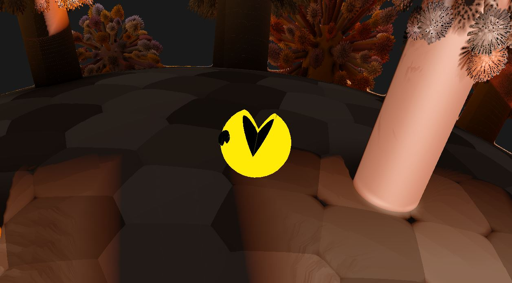
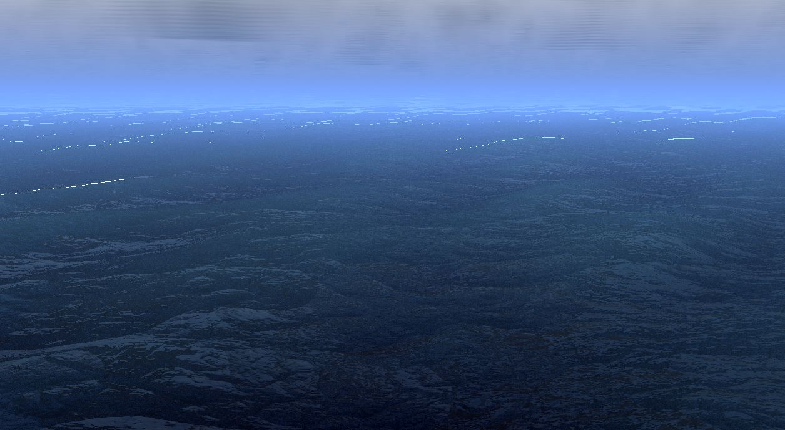
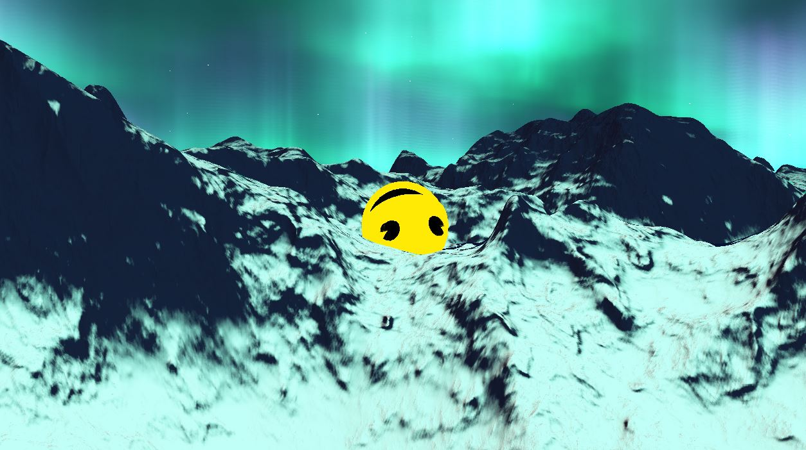

# TFG

### GENERACION DE TERRENOS FRACTALES PARA ESCENAS 3D, EN OPENGL Y VULKAN
Trabajo de Fin de Grado del Grado en Desarrollo de Videojuegos de la Universidad Complutense de Madrid.   
Jorge Rodriguez Garcia    
Diego Baratto Valdivia   
Gonzalo Sanz Lastra   

### INSTRUCCIONES
Para compilar el contenido de este repositorio, es necesario ademas descargar sus dependencias,
que pueden ser encontradas en https://mega.nz/file/VksBQIgI#fTnYkODXRB52XNak2SiU1ewWALkkKvWttAe6CSpPSPw.
Una vez descargadas, deben descomprimirse dentro del directorio ProyectoTFG, y copiar los archivos
Dependencies/assimp/lib/assimp-vc141-mt.dll y Dependencies/assimp/lib/assimp-vc141-mtd.dll a la carpeta
ProyectoTFG/exes/OpenGL/ (crear carpeta si no existe). Deben copiarse tambien los archivos Dependencies/vcruntime140_1.dll y
Dependencies/vcruntime140_1d.dll tanto en ProyectoTFG/exes/OpenGL/ como en ProyectoTFG/exes/Vulkan/ (crear carpetas si no existen).
Por ultimo, se debe asegurar que en las propiedades del proyecto Main, en el apartado Depuracion, el
directorio de trabajo este establecido como $(TargetDir) en todas las configuraciones.

Si se quiere probar la aplicacion sin necesidad de compilar el contenido del repositorio, se puede acceder
a los ejecutables a traves del siguiente enlace: https://mega.nz/file/Q99hGJAD#lAL6_NHfiX9m3VZKfZbA5KQJwxBXTzv9MpM-UuMtfTI.

### INSTRUCTIONS
In order to compile the content of this repository, it is needed to download its dependencies,
which can be found in https://mega.nz/file/VksBQIgI#fTnYkODXRB52XNak2SiU1ewWALkkKvWttAe6CSpPSPw.
Once downloaded, they must be decompressed into the ProyectoTFG directory, and you must copy the
Dependencies/assimp/lib/assimp-vc141-mt.dll and Dependencies/assimp/lib/assimp-vc141-mtd.dll files into the
ProyectoTFG/exes/OpenGL/ folder (you must create the folder if it doesn't exist). Dependencies/vcruntime140_1.dll and Dependencies/vcruntime140_1d.dll files
must be also copied into ProyectoTFG/exes/OpenGL/ and ProyectoTFG/exes/Vulkan/ directories (you must create the folders if they don't exist).
Finally, you must check if in the Main project properties, in the Debug section,
the working directory is set to $(TargetDir) in all the configurations.

If you want to run the application without compiling the content of the repository, executables can be accessed through
the next link: https://mega.nz/file/Q99hGJAD#lAL6_NHfiX9m3VZKfZbA5KQJwxBXTzv9MpM-UuMtfTI.

### Resumen
Aplicación interactiva para renderizar terrenos fractales, utilizando el algoritmo Ray Marching, y modelos basados en mallas de vértices, basado en la tubería clásica de renderizado. Se incorpora también un movimiento físico del modelo sobre las superficies generadas, mediante el cálculo de puntos de colisión entre ellos. Además, la aplicación permite utilizar como API de programación gráfica OpenGL y Vulkan, con GLSL como shading language.

### Abstract
Interactive application in order to render fractal terrains through the Ray Marching algorithm and vertex mesh models using the classic rendering pipeline. Collision points between them can be calculated, allowing a simple, physical movement of the model upon the created surfaces. Furthermore, the application lets OpenGL and Vulkan to be used, with GLSL as shading language.

### Ejemplos / Examples

#### Autumn planet

#### Ocean terrain

#### Snow terrain

### Referencias
Se puede consultar el documento relacionado con la investigación del TFG y las referencias que se han seguido para obtener el resultado en: https://eprints.ucm.es/view/tipocentroagrupa/tfg/18/

### References
All the references and the document related with this investigation are available at: https://eprints.ucm.es/view/tipocentroagrupa/tfg/18/
